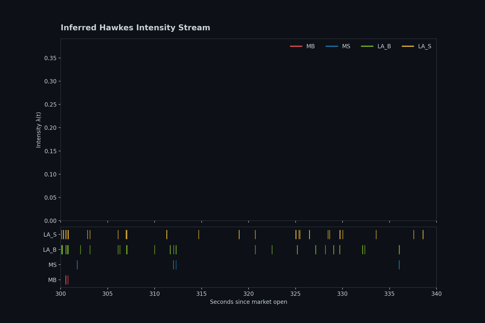
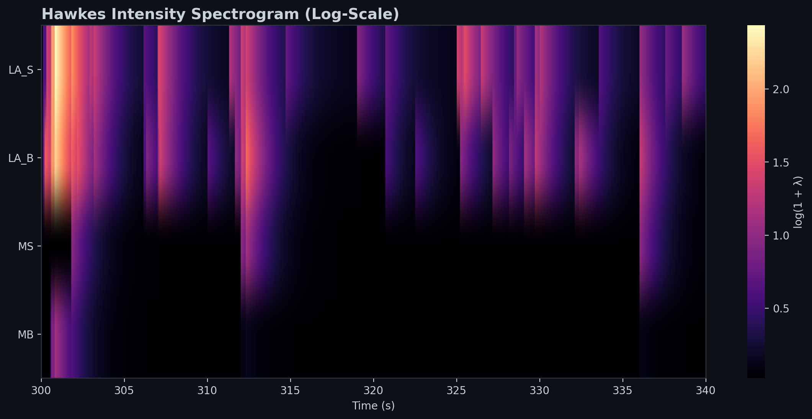
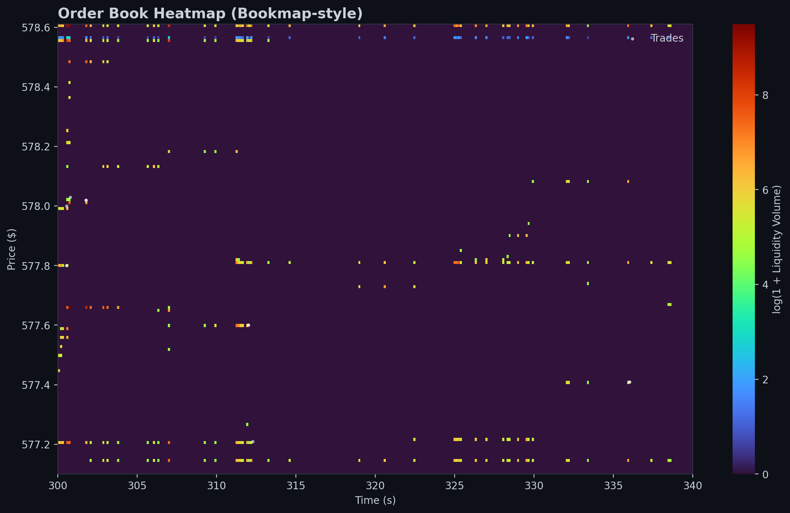
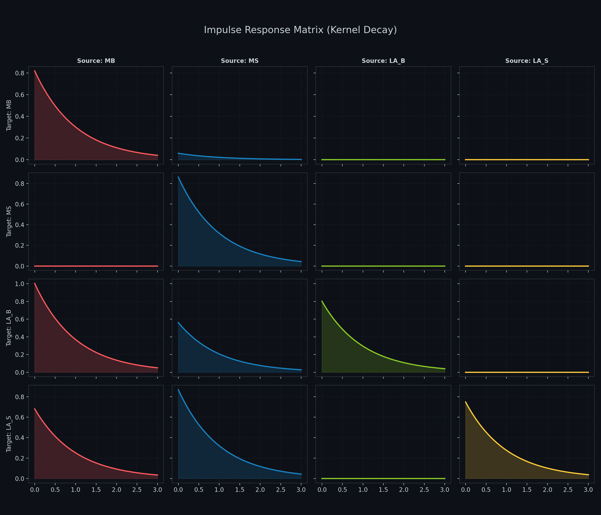
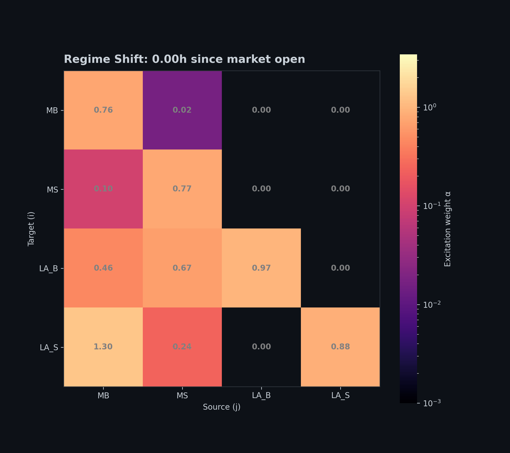
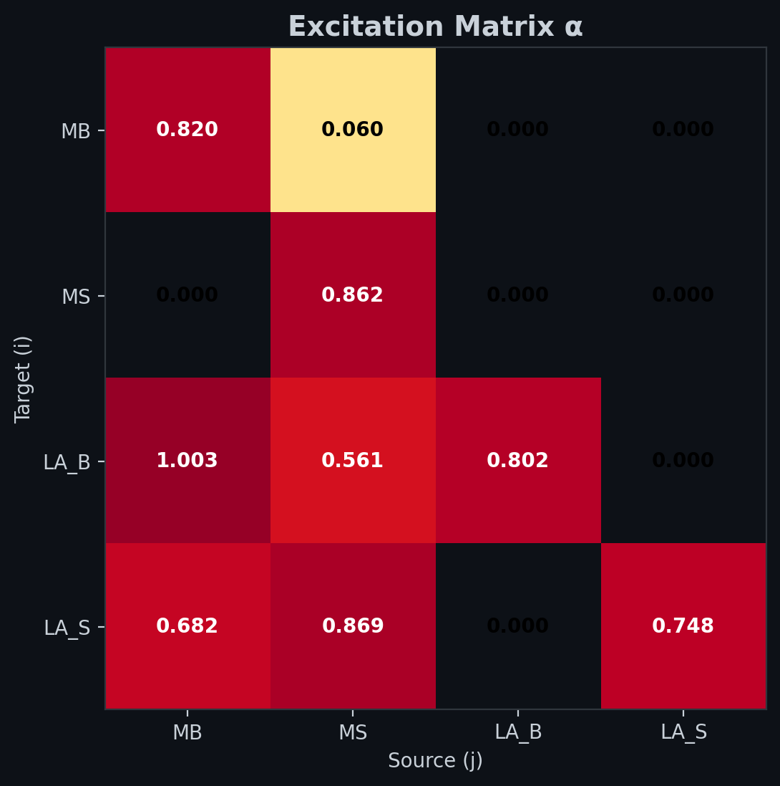

# HawkesLOB: Microstructure Self-Excitation Study

[](LICENSE)

A rigorous fit of a multivariate Hawkes process to limit order book (LOB) event data, featuring residual analysis via the time-rescaling theorem and high-density technical visualizations.

### Dynamic Intensity Stream (Hero)

*60-second snapshot of LOB events. Top: Stacked conditional intensities λᵢ(t). Bottom: Actual event tick marks (Market Buys, Market Sells, Limit Additions).*

---

## Overview

This project implements a 4-dimensional Hawkes process to model the self-exciting dynamics of high-frequency trading events. By analyzing LOBSTER event logs, we quantify how aggressive trades trigger limit order replenishment and further clustering of market activity.

### Key Features
- **Multivariate Modeling**: Fits baseline intensities ($\mu$) and an excitation matrix ($\alpha$) for Market Buys, Market Sells, and Limit Additions.
- **High-Density Visuals**: Signal-processing inspired spectrograms and Bookmap-style liquidity heatmaps.
- **Dynamic Regime Analysis**: Rolling 30-minute window fits capture how excitation evolves from market open to close.
- **Statistical Rigor**: Validates model fit using the **Time-Rescaling Theorem** with Kolmogorov-Smirnov (KS) tests and Ljung-Box residual checks.

---

## Visualizations

The repository prioritizes **legible, dense, and technical** 2D signals over decorative 3D plots.

### 1. Intensity Spectrogram (Signal Logic)
Visualizes Hawkes conditional intensity as a time-frequency spectrogram. This surfaces cross-excitation "bursts" across all 4 event types with zero perspective distortion.


### 2. Bookmap-style LOB Heatmap
A professional-grade liquidity landscape showing Price vs. Time. Volume is log-scaled to reveal hidden depth, with actual trade events (Market Orders) overlaid.


### 3. Impulse Response Matrix (Small Multiples)
Mathematical transparency: A 4×4 grid of 1D decay curves surfacing the exact trigger-response dynamics ($G_{ij}(t) = \alpha_{ij} \beta e^{-\beta t}$).


### 4. Regime Shift Analysis (Rolling Alpha)
An animated heatmap showing how the excitation matrix $\alpha$ evolves over the trading day, capturing shifts in market microstructure regimes.


---

## Excitation Dynamics

### The Excitation Matrix (α)
The matrix below shows the average excitation weights over the full trading day. Note the strong diagonal (self-excitation) and the impact of market orders on limit order additions.



**Key Observations:**
1. **Self-Excitation**: Market orders are highly clustered ($\alpha_{ii} \approx 0.82-0.86$).
2. **Liquidity Provision**: Aggressive buys (MB) trigger a massive surge in limit buy additions (LA_B), indicating a "super-critical" local response where market makers aggressively restock the book.
3. **Regime Shifts**: Our rolling window analysis shows the spectral radius $\rho(\alpha)$ fluctuating between **0.75 and 0.90**, peaking during periods of high volatility.

---

## Methodology

### The Model
We use a multivariate Hawkes process with exponential kernels:

$$\lambda_i(t) = \mu_i + \sum_j \alpha_{ij} \sum_{t_{jk}<t} \beta \cdot e^{-\beta(t-t_{jk})}$$

Where:
- $\mu_i$: Baseline intensity of event type $i$.
- $\alpha_{ij}$: Excitation weight (impact of event $j$ on type $i$).
- $\beta$: Shared exponential decay rate (inverse half-life of excitation).

### Validation (The Time-Rescaling Theorem)
Under the true model, transformed inter-event times $\tau$ should be i.i.d. $Exp(1)$. We test this using:
1. **KS Test**: Comparing empirical quantiles against the theoretical Exponential distribution.
2. **Ljung-Box**: Checking for serial correlation in residuals.

---

## Setup & Reproducibility

### 1. Environment
```bash
python3 -m venv .venv
source .venv/bin/activate
pip install -r requirements.txt
```

### 2. Patching `tick`
The `tick` library requires a small patch for Python 3.12+ compatibility (included in this repo):
```bash
python scripts/patch_tick.py
```

### 3. Data Acquisition
1. Go to [LOBSTER Data Samples](https://lobsterdata.com/info/DataSamples.php).
2. Download the `GOOG_2012-06-21` (10 levels) zip file.
3. Extract into the `data/` directory.

### 4. Command Executions

Run the following commands in sequence to reproduce the analysis and generate the visualizations:

**A. Initialize the Analysis Notebook**
Generates the core Jupyter notebook with pre-configured cells.
```bash
python notebooks/create_notebook.py
```

**B. Run Global Fit & Primary Visuals**
Fits the 4D Hawkes model and generates the primary assets (Hero GIF, Spectrogram, Bookmap, Cascade Matrix).
```bash
python src/model.py
```

**C. Run Rolling Window Analysis**
Executes the sliding-window fits and generates the animated regime shift heatmap.
```bash
python notebooks/02_rolling_fit.py
```

**D. View Results**
All high-density assets are stored in the `outputs/` directory.

---

## Limitations & Future Work

While the exponential Hawkes process provides a strong baseline, several areas offer significant room for improvement:
1. **Kernel Shape**: Replacing exponential with **Power Law (Pareto)** kernels to capture heavy-tailed memory.
2. **Asymmetric Decay**: Modeling different decay rates $\beta_i$ for each event type.
3. **Price Impact**: Integrating price changes as a covariate to model the volatility-excitation feedback loop.

---

## License
Licensed under the [Apache License, Version 2.0](LICENSE).